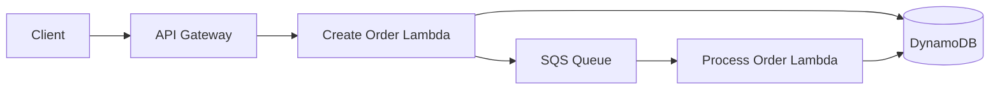

# Architecture — Serverless OrderFlow

## Design goals

- Clear separation of presentation, API, business logic and infrastructure concerns.
- Explicit boundaries that can be replaced with managed cloud services.
- Testable components with configuration supplied through environment variables.
- Secure defaults and no secrets in source control.

## Client-facing talking points

1. Explain the business problem first.
2. Show the architecture diagram.
3. Walk through one end-to-end request.
4. Show tests and CI.
5. Explain how the system would be deployed and monitored in production.
